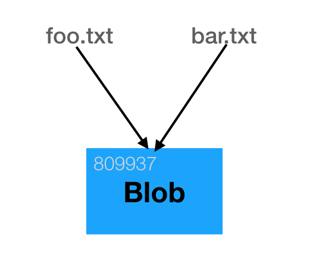
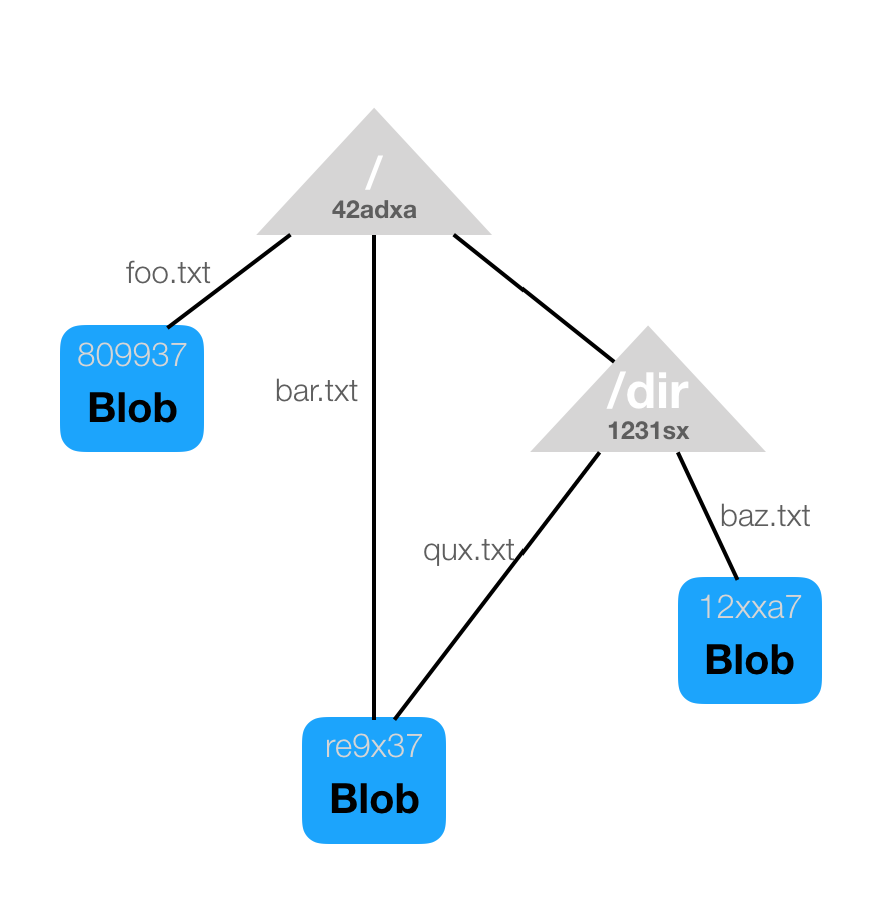
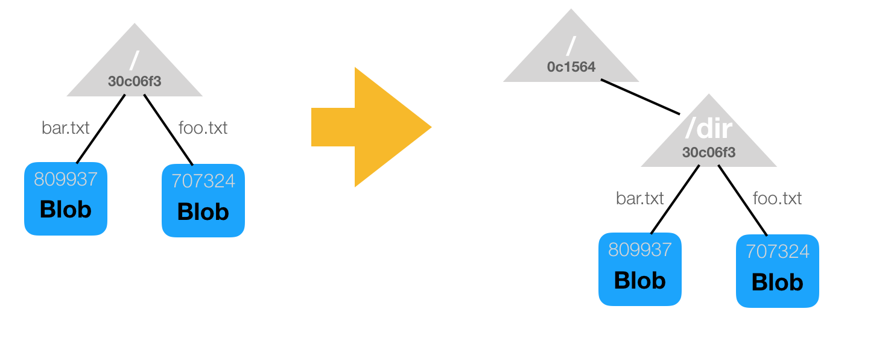
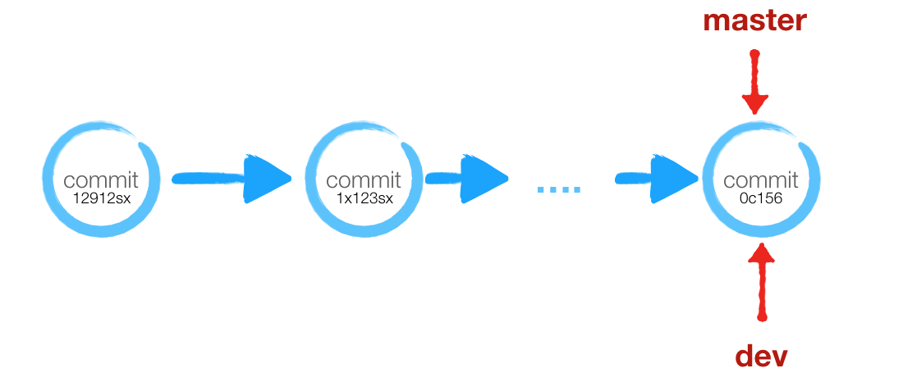
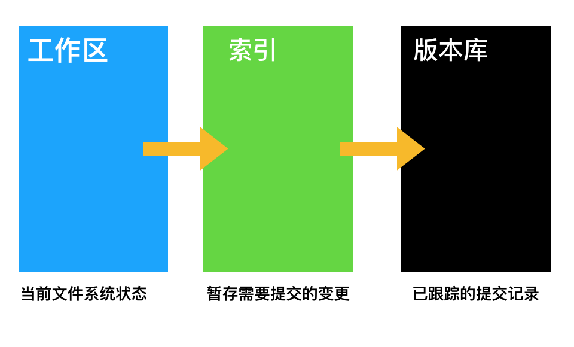
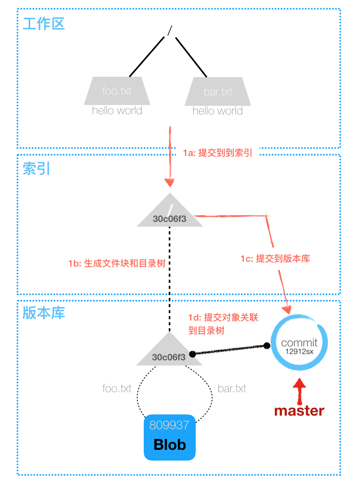
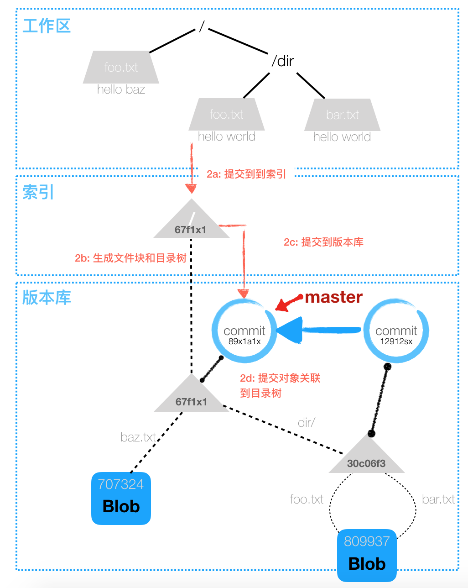

# Git 基本概念

既然 git 那么优秀, 空说无凭. 下面介绍 Git 的一些基本原理, 这是一块很有价值的地方.

通过理解 Git 的基本原理,  我们可以见证 Git 为什么比别的 VCS 要高效和轻量. 这也有利于我们快速上手，更有效地利用这个工具, 提高开发协作的效率

## 1. 基本概念

在我们调用`git init`后项目的根目录就会出现一个`.git`目录，这个目录包含了所有版本库的信息。

```shell
hello
  .git
    ├─hooks                     -- 定义钩子
    │   ├─pre-commit
    │   ├─pre-commit.sample
    │   ├─post-commit
    │   ├─post-commit.sample
    │   └─...
    ├─info
    │  └─exclude
    ├─objects                   -- 对象库
    │  ├─....
    │  ├─info
    │  └─pack                   -- 对象打包压缩文件
    │─refs                      -- 对象引用
    │   ├─heads
    │   ├─remotes
    │   └─tags
    ├─HEAD
    ├─config
    ├─desciption
    ├─index                     -- 索引
    └─...
```

Git 主要有两种数据结构：`对象库(Object Store)`和`索引(Index)`。

在 Git 中，每个文件、目录、提交以及标签都使用“对象”来进行存储。

### 1.1 文件对象

文件使用块(blob)进行表示， 块是一个二进制的序列. Git 的一个关键的概念就是`“内容驱动的”`，而不是像 SVN 基于文件和目录的布局，
Git 追踪的是内容而不是文件。块中不会存储任何关于文件的元信息， 这些元信息在`目录对象`中描述。

所以, 如果两个文件的内容完全一致，Git 只会使用一个块进行存储。这样可以节省存储空间. 例如：

```shell
# 创建两个内容一模一样的文件
$ echo "hello world" > foo.txt
$ echo "hello world" > bar.txt

# 在没有添加到索引(暂存区)或者版本库之前，Git是不会创建这些对象, 关于工作区/索引版本库
# 的概念， 在下文中描述. 现在将文件添加到索引(索引可以理解为提交到版本库之前的暂存区)
$ git add foo.txt bar.txt

# 列出索引区中创建的文件对象
# ls-files命令类似于`ls`命令
$ git ls-files --stage
100644     80993781b54ed1b81e47a31e6427940c1a9deafb 0       bar.txt
100644     80993781b54ed1b81e47a31e6427940c1a9deafb 0       foo.txt
# 文件权限  SHA1 散列                                        文件名

# 可以看出文件块已经添加到git对象库中;
# git使用SHA1的第一个字节作为目录，来避免把很多文件放在同一个目录中(一些文件系统会变卡)
# git 使用zlib压缩存储这些对象
$ tree .git/objects
├─80
│ └─993781b54ed1b81e47a31e6427940c1a9deafb
├─info
└─pack
```

从上面的执行结果可以看出，`foo.txt`和`bar.txt`的散列值是一样的。对于 sha1 编码来说，只要输入的内容一致， 输出的内容也是一致的。所以也说明这两个文件是共享同一个块的。



> 关于 SHA1 散列值:<br/>
>
> 上述的 SHA1 散列值可以认为是`对象ID`，通常表示为一个 40 位的 16 进制字符串. Git 会对`对象的内容`应用 SHA1 得到. <br/>
> 对于`文件`来说应用的内容是`块`，即文件的二进制表示;
> 对于`目录`来说， 应用的内容是`目录信息`; <br/>
> 对于`提交`来说，应用的内容是提交信息、目录对象、作者、提交时间、父提交等元数据; <br/>
> 对于`标签`来说, 应用的内容是标签标注和关联的提交.<br/>
> 总的来说这个散列值可以唯一地标志一个`对象`. SHA1 值在 git 的命令用的非常广泛, 但是如果要输入完整的
> SHA1 值是非常麻烦的事情，git 支持输入 SHA1 值的前缀。如下面的 `cat-file` 命令所示

我们可以使用`cat-file`命令来查看对象的内容。`cat-file`类似于`cat`命令:

```shell
# 查看对象类型；输入SHA1值的前缀，只要不冲突即可
$ git cat-file -t 8099378
blob

# 查看对象的内容
$ git cat-file -p 8099378
hello world
```

每一个文件的版本都会使用一个块进行表示. 每当文件变动，Git 就会为这个文件(完整文件)计算一个新的 SHA1 值. 并将完整文件的内容保存为块。看到这里， 你可能像我一样会有疑问，为什么 git 不保存差异? 而是保存完整的文件副本，这不是浪费空间吗？

```shell
# 追加一行到foo.txt
$ echo "hello gzb" >> foo.txt
$ git add foo.txt
# 我们看到foo.txt的SHA1已经变化了, bar.txt依旧引用80993
$ git ls-files --stage
100644 80993781b54ed1b81e47a31e6427940c1a9deafb 0       bar.txt
100644 aa1284b52c5fa5beca04b102d342261d01db289d 0       foo.txt
$ git cat-file -s aa1284
46                        # foo.txt 文件大小
$ git cat-file -s 889937
28                        # bar.txt 文件大小
```

实际上，Git 会这么做, 只不过不是马上做。上面存储对象格式称为`松散格式(loose)`. 像编程语言的垃圾回收机制一样， Git
会时不时地将多个对象`打包(pack)`成为一个"`包文件(packfile)`", 以节省空间和提高效率。

Git 首先会定位内容非常相似的`块`， 为他们之一存储整个内容， 之后再计算相似文件之间的差异，并只存储差异。例如上面的 foo.txt 和
bar.txt 文件，git 可能会存储整个 foo.txt 的内容，然后再单独存储两者之间的差异.

相对于 SVN 这类基于文件的 VCS，Git 内容驱动的方式，更能有效地节省空间，因为块是全局的。而 SVN 只能为同一目录的同名文件计算差异.

> 当版本库中保存了太多`松散对象`, 或者你向远程服务器推送， 以及手动调用`git gc`命令时，git 会进行打包。比如
>
> ```shell
> $ git push origin master
> Counting objects: 20, done.
> Delta compression using up to 4 threads.
> Compressing objects: 100% (20/20), done.
> Writing objects: 100% (20/20), 1.66 KiB | 340.00 KiB/s, done.
> Total 20 (delta 17), reused 0 (delta 0)
> To ssh://code.ejiahe.com:25522/WEB/sms2.0-client.git
>    95c66b1..9c9d863  master -> master
> ```

```shell
# 垃圾回收; 打包
$ git gc

# 我们发现之前的两个对象文件都不见的。因为他们被压缩打包进了包文件
# .pack 文件包含了所有从文件系统移除的对象
# .idx 包含了这些对象在.pack包文件中的偏移信息. 可以用于快速定位一个指定的对象
$ tree .git/objects
├─info
└─pack
  ├─pack-41941a802863135106a20d7f3663ed393ed33b3a.idx
  └─pack-41941a802863135106a20d7f3663ed393ed33b3a.pack

# 可以通过verify-pack 命令来查看索引文件. 这里举一个其他项目的例子
$ git verify-pack -v .\.git\objects\pack\pack-xxx.idx
22e70521f125689c969e1e94a9ca3fcb61b579ed blob   20 33 3546
41ec12446a664f43df51df2d953c5c04b34b265e blob   872 511 3579
1038dc0ce035045626b2efa60b16883a3507ad5b blob   80 95 4090 1 41ec12446a664f43df51df2d953c5c04b34b265e

# 1038dc为差异内容，其完整内容是41ec12.
# 在git完整内容一般是最新文件内容。 因为最新文件内容访问的频率较高
```

### 1.2 目录对象

上面大概讲述了一个文件在 git 中的存储方式。文件的元信息就存储在一个称为"`目录树(tree)`"的对象中。估计你已经想到这个对象会包含什么内容：

* 目录包含的块, 以及块的文件信息
* 子目录树

> 注意这里没有包含目录的路径信息和目录名。这个道理和文件块对象一样，git 是`内容驱动的`. 关于目录的路径和目录名，在父目录对象描述。<br/>
> 这样，像文件块一样，目录不管在项目哪个位置，只要目录包含的内容不变, 目录对象就不变（SHA1 不变）.
> 另外如果两个不同路径或名字的目录包含的文件和目录是一样的, 这两个目录共享同一个目录对象

那么项目的目录树可以表示为：<br/>



跟文件对象一样，Git 会为目录树计算一个 SHA1 值， 这个 SHA1 值可以用来高效地比对。 比如比较 foo 目录修改前和修改后的 SHA1 值，如果 SHA1 值相等，就说明 foo 目录内容没有变化，没有必要向下递归比对了。

上面， 我们将`foo.txt`和`bar.txt`文件添加到索引(暂存区)中, Git 还没有为他们创建目录对象。Git 会在`用户提交`或者手动调用底层的`write-tree`命令之后创建一个新的目录对象。

> 这个目录树是从当前索引中捕获的. 而不是工作区

```shell
# 立即创建一颗目录树. 这个命令返回这棵树的SHA1值
$ git wirte-tree
30c06f321a0a9838685e85ad87c330d067b59515

# 同样可以使用cat-file命令来查看目录树的内容
$ git cat-file -t 30c06
tree
$ git cat-file -p 30c06
100644 blob 80993781b54ed1b81e47a31e6427940c1a9deafb    bar.txt
100644 blob 707324cde0d21955bb8e7bfdaaa10007dd8d54fe    foo.txt


# 现在将foo.txt和bar.txt移到一个新的目录
$ mv *.txt dir/

# 添加到索引
$ git add .

# 可以看到foo.txt, bar.txt的块对象没有变化
$ git ls-files --stage
100644 80993781b54ed1b81e47a31e6427940c1a9deafb 0       dir/bar.txt
100644 707324cde0d21955bb8e7bfdaaa10007dd8d54fe 0       dir/foo.txt

# 再创建目录树对象: 因为目录结构发生了变化，所以重新创建一个新的对象
$ git wirte-tree
0c1564cd525d98a691c29779569348b3bdc0a8ce

# 在这里你可以看到dir目录对象的SHA1和上面的根目录的SHA1是一样的！
# 因为dir和之前的根目录内容是一样的，所以git复用了这个目录对象
$ git cat-file -p 0c1564
040000 tree 30c06f321a0a9838685e85ad87c330d067b59515    dir
```



### 1.3 提交对象

看到这里， 估计你对 git 的工作原理已经有点眉目了。上述的`目录树`可以理解为`项目文件结构的一个快照`. 而我们的`提交记录`就是就是关于`目录树`的时间轴列表。 如图：


提交记录就是项目的`变更记录`. Git 同样会为每个提交生成一个`提交对象`. 提交对象包含的内容有：

* 提交时的项目快照， 也就是目录树对象
* 提交的元数据，如作者，时间，提交信息等等
* 父提交对象。除了`根提交`, 其他提交都有父提交。提交之间是一种`图`的关系(一个提交可能有多个子提交, 也有可能有多个父提交)

```shell
# 现在将'索引'中的目录对象提交到版本库
$ git commit -m "第一个提交"
[master (root-commit) 985b842] 第一个提交
 2 files changed, 0 insertions(+), 0 deletions(-)
 create mode 100644 dir/bar.txt
 create mode 100644 dir/foo.txt

# 上面git创建了一个提交对象. 通过cat-file命令可以看到这个提交对象的内容
# 这个提交对象关联到了上面创建的目录树对象
$ git rev-parse 985b84
985b84227a97f0b09ffe86ea16c27cf8ce4dfb6e

$ git cat-file -p 985b84
tree 0c1564cd525d98a691c29779569348b3bdc0a8ce
author gq-li <gq-li@mygzb.com> 1518001414 +0800
committer gq-li <gq-li@mygzb.com> 1518001414 +0800

第一个提交
```

提交对象之间构成的图结构就是项目的整个历史周期. 下面是一个典型`Git flow`驱动下的提交记录图:


### 1.4 标签

支持我们已经大概了解了 Git 的基本原理. 现在介绍最后一个对象, 即标签对象.标前对象是最简单的对象, 你可以将`标签`视作为`提交`的别名,
或者说标签是提交对象的引用/指针.
标签可以给你的`提交对象`取一个相对`SHA1值`更好记忆的名字, 比如版本号, 如 v1.0.0.
所以一个标签对象是和提交对象绑定在一起的, 标签对象的内容有:

* 引用的提交对象
* 标签的标注


```shell
# 使用git tag命令创建标签
$ git tag -a -m "第一个标签信息" v0.0.1 985b84

$ git rev-parse v0.0.1
303e1bc3317f8b771dfce6c9faf4a319583eaa52
# 或者通过.git/refs/tags/v0.0.1查看标签名引用的对象SHA1; 结果同上
$ cat .git/refs/tags/v0.0.1

# 同样使用cat-file来查看标签对象内容
$ git cat-file -p 303e1bc
object 0c1564cd525d98a691c29779569348b3bdc0a8ce
type commit
tag v0.0.1
tagger gq-li <gq-li@mygzb.com> 1518010590 +0800

第一个标签信息
```

### 1.5 那分支是什么?

Git 中并没有所谓的"分支对象", 分支只不多是提交记录的引用, 换句话说, 分支是不同提交记录的开发线的`最新提交`的引用.
关于提交对象的引用, 都保存在查看`.git/refs`目录

```shell
$ tree .git/refs
.git/refs
├── heads                -- 这里放置的是本地
│   └── master
├── remotes              -- 这里放置的是远程版本库的分支
│   └── origin
│       ├── HEAD
│       └── master
└── tags                 -- 这里放置标签
```

假设现在创建一个新的分支:

```shell
# 最新的提交对象为
(master)$ git rev-parse master
0c1564cd525d98a691c29779569348b3bdc0a8ce
# 创建并切换到dev分支
(master)$ git checkout -b dev

# 和master一样, 指向同一个分支. 即在同一个节点
(dev)$ git rev-parse dev
0c1564cd525d98a691c29779569348b3bdc0a8ce
```



现在在 dev 创建一些内容, 并提交

```shell
(dev)$ echo "dev here i am" > baz.txt
(dev)$ git add .
(dev)$ git commit -m "我在dev分支创建了baz文件"
[dev 558fc73] 我在dev分支创建了baz文件
 1 file changed, 1 insertion(+)
 create mode 100644 baz.txt

# 查看dev引用的: dev已更新到最新的提交对象
(dev)$ git rev-parse dev
558fc733e37a0a8ffa8b874ec3bafd418d08fb9a
```


尽管和标签一样都是提交对象的引用, 但是切换到标签后是不能提交新内容的, 而分支则允许继续提交延展.


由上可以看到, Git 的分支非常轻量, 而 SVN 的分支则需要拷贝文件结构. 当 Git 进行分支切换时, 会将当前工作区的文件系统, 还原到分支引用的`提交对象`所绑定的`目录对象`.

### 1.6 索引

上面有提到`工作区`, `索引`和`版本库`的概念。 一个`变更`需要经过索引才能提交到版本库:



`工作区`就是当前`文件系统`的文件结构; `索引`可以视作一个提交的`暂存区`(stage), 好处就是将`工作区`和`版本库`隔离开来，你可以筛选需要提交到版本库的变更，避免将工作区的所有内容都提交了。这个概念在 SVN 也是有的。

从上面的`提交对象`来看。 索引其实就是存储了一个临时的、动态的`目录树`. 一旦提交触发， Git 就会捕获并绑定索引存储的目录树, 生成`提交对象`.

```shell
# 可以通过git status来查看索引的状态
$ git status
```

因为索引的存在, 我们可以将 Git 的文件内容划分为 3 类：

* 已跟踪的（Tracked）: 即已经添加到版本库或索引的文件
* 被忽略的（Ignore）: 被声明为忽略的文件，可以通过.gitignore 进行声明；比如临时文件，编译文件，这些我们不希望添加到版本库的，但是又懒得每次添加索引时要过滤掉它们的文件. 被忽略的文件被 git status, git add 等命令自动忽略
* 未跟踪的（Untracked）: 即在工作区中已经变更，但未提交到索引的文件

## 2. 总结一个文件的提交过程

现在来回顾一下, 一个文件是如何提交到 git 版本库的.



1. 首先创建两个文件 foo.txt 和 bar.txt, 它们的内容都是"hello world"
2. 使用`git add`命令添加到`索引`, 准备进行提交
3. 提交到索引后, git 会为文件生成`块对象`, 因为 foo.txt 和 bar 的内容一样, 所以他们共用一个块对象
4. 使用`git commit`提交到`版本库`, Git 会捕获`索引`状态, 并生成一个`目录树对象`
5. 创建一个`提交对象`, 绑定到`目录树对象`
6. `master分支引用`到最新的`提交对象`



1. 现在创建一个新的文件 baz.txt, 并将 foo.txt 和 bar.txt 移动到 dir 目录
2. 添加到索引并进行提交
3. 由于 dir 保存的内容(foo.txt, bar.txt)并没有发生变化, 所以可以复用`目录树对象`(30c06f3)
4. 新建一个新的`块对象`来存储 baz.txt 的内容; 新建`目录树对象`(67f1x1)表示当前的文件系统`快照`
5. 新建一个`提交对象`, 关联到`目录树对象`(67f1x1).新提交对象的`父提交对象`是 12912sx
6. 更新 master 引用
