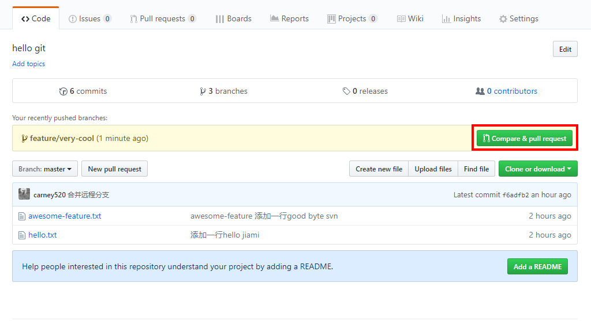
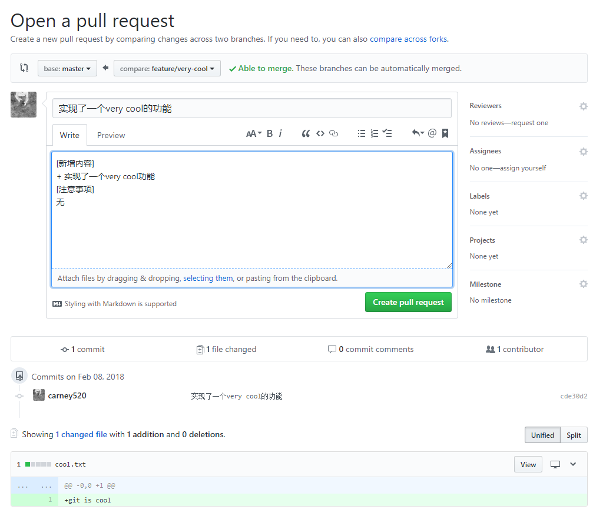

# 功能分支工作流

随着项目规模变大, 和成员分工的细化，集中式工作流的弊端就会显现出来, 比如不同的成员开发不同的功能，所有代码都往 master 分支上丢，不管是完成还是没完成，稳定还是没有稳定。这样导致我们无法随时构建和发布一个稳定的版本出来。

`功能分支工作流`是以`集中式工作流`为基础的。它提倡为各个新功能分配一个专门的分支来开发， 当功能分支稳定，或者说经过完备的测试之后才合并到 master 分支。


`功能分支工作流`相较`集中式`工作流的有点：

* 保持主干的干净。隔离了多个开发者在各自功能上的开发不会扰乱主干代码
* 提供了`代码review`的空间。功能分支在合并到主干之前，触发集成测试，或者开启`Pull Request`, 启动一个围绕分支的讨论。发挥群众的力量

## 1. 适用场景

适合分工明确，版本关系简单的项目.

## 2. 示例

### 2.1 创建分支

基于上文集中式工作流的项目，现在 Jim 负责开发一个 very cool 功能:

```shell
# 创建分支并马上切换
(Jim)$ git checkout -b feature/very-cool

# 上面的命令相当于
(Jim)$ git branch feature/very-cool
(Jim)$ git checkout feature/very-cool

# 查看当前分支
(Jim)$ git branch
* feature/very-cool
master
```

> 分支命名规范: <br/>
> 在这里推荐适用有带层次的分支命名方式，比如功能分支为 feature/xxx, bug 分支为 bug/B121231,
> 发布分支为 release/v1.0.1. 因为 git 的一些命令支持使用通配符的形式。另外在有很多分支时，可以较快地区分不同类型的分支<br/>
> 如: `git show-branch 'bug/*'`

### 2.2 推送到远程分支

ok, 假设 Jim 已经将 very cool 功能开发完毕了，现在要推送到远程版本库，给首长和群众检阅:

```shell
# 提交到远程库的feature/very-cool分支
(Jim)$ git push -u origin feature/very-cool
```

`-u`是`--set-upstream-to`的简写，它的意思是将当前本地分支的上游绑定为远程分支。换句话说，就是本地分支和远程分支对应起来。这个选项只需要在第一次推送时设置。设置了上游之后，以后推送和拉取就不需要添加参数了：

```shell
# 设置了上游之后，下次拉取和推送就不需要指定远程库和分支了
(Jim)$ git pull
(Jim)$ git push
```

### 2.3 发起 Pull Request

`github`和`gitlab`都支持`Pull Request`, 将功能分支提交到远程版本库之后， 项目首页就会出现 Pull Request 的按钮:



这个类似于我们在工作宝群上发一个通告，通知团队成员完成了什么事情:



项目成员可以对这个分支的提交进行讨论和 代码 review, 最后由`项目负责人`合并到`master`


### 2.4 合并 Pull Request

Pull Request 可以在`gitlab`或`github`的页面上进行， 如果你要使用自定义的策略进行合并。负责人也可以将分支拉取到本地进行合并.

```shell
$ git checkout master
# 保持master为最新版本
$ git pull

# 合并远程分支到master分支 等价于: `git merge feature/very-cool`
$ git pull origin feature/very-cool

# 推送最新版本到远程版本库
$ git push
```

如果你不需要保留分支了，可以使用下列命令删除分支

```shell
# 删除分支：
$ git branch -d feature/very-cool
# 删除远程分支
$ git push -d origin feature/very-cool
```
