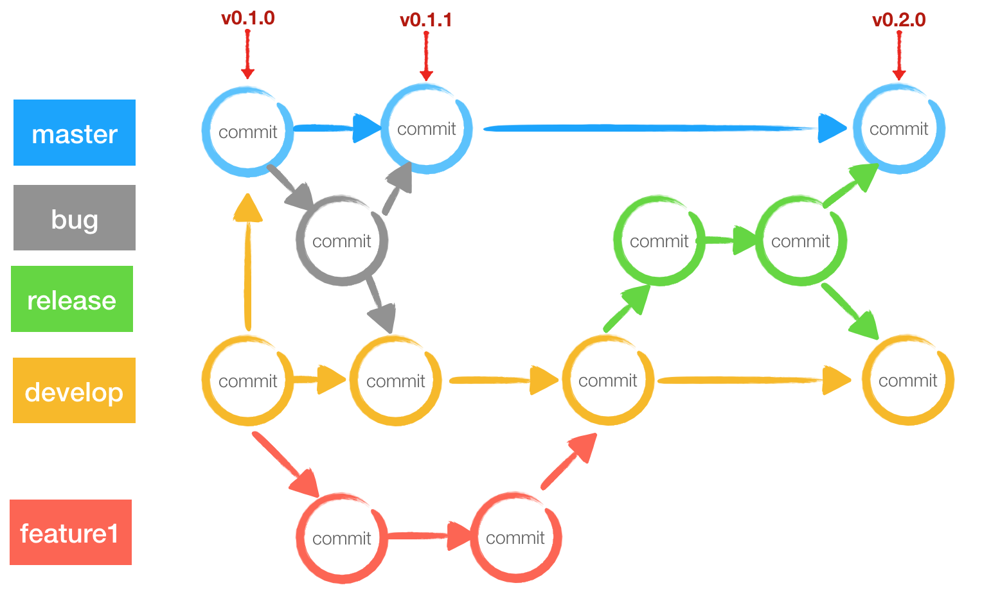
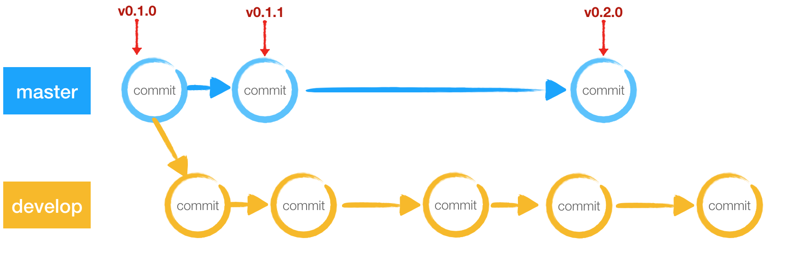
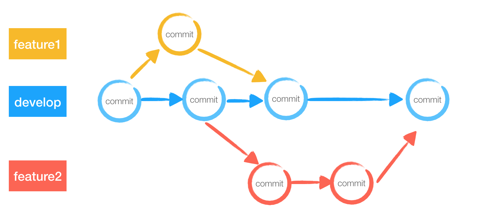
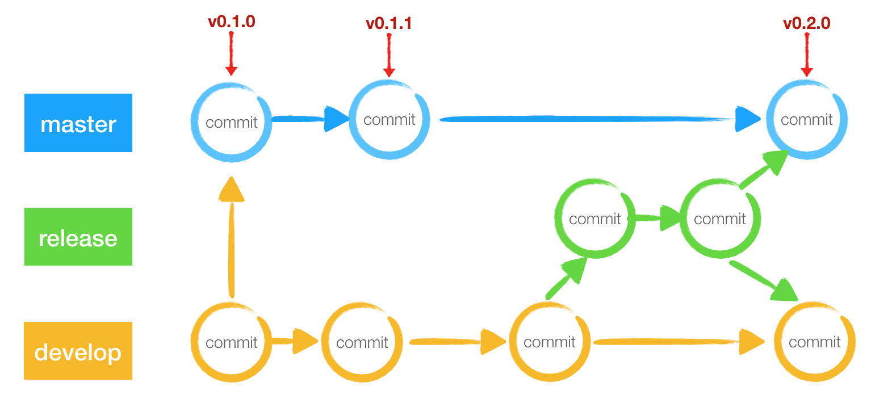
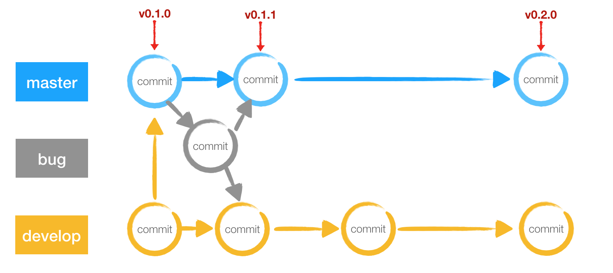

# Git Flow

`功能分支工作流`只定义了`功能分支`的职责， 但是现实中的项目往往复杂得多。我们可能要同时维护多个版本，我们可能要修复多个版本上的 bugs。所以就有了 Git Flow 工作流。

`Git Flow 工作流`继承了`功能分支工作流`, 定义了更为严格的分支模型。定义了各种分支的`职责`和`使用场景`以及`生命周期`:



## 1. 分支定义

### 1.1 历史分支



GitFlow 使用两个分支来记录项目的历史记录，即`master`分支和`develop`分支. 所谓`历史分支`是相对于`临时分支`: `临时分支`有`功能分支`和`修复分支`以及`发布分支`, 这些分支完成自己的使命后就会被删除。而`发布分支`则一个没有'未来'的分支，它的历史可能停留在发布的那一刻。

* `master` 这是一个稳定的分支, 又称为保护分支， 表示正式发布的历史, 所有对外正式版本发布都会合并到这里, 并打上版本标签。
* `develop` 开发分支用来整合功能分支， 表示最新的开发状态。等价于`功能分支工作流`的`master`分支.

> 注意每次合并到 master 都要打上 tag, 方便定位

### 1.2 功能分支

`功能分支`的职责无须赘述。这里和`功能分支工作流`不一样的是，`功能分支` 从`开发分支`中分叉出来，当新功能完成后，在合并回`开发分支`



### 1.3 发布分支

一旦到了发布时机，比如`开发分支`积累了足够的功能或者到了既定的发布日期。 就从`开发分支`上分叉出一个`发布分支`. 然后开始`发布循环`， 从此刻开始新的功能不会加到这个分支，这个分支只应该做 bug 修复， 文档生成和其他面向发布的任务。



当`发布分支`稳定到足以合并到`master`的时候， `发布分支`的生命周期可以结束了。这时候我们将稳定的发布分支合并到`master`分支，然后打上 tag 版本号；接着还需要将`发布分支`合并回开发分支。

> 该不该保留发布分支？<br/>
> 你可以删掉它，因为在 master 上打了 tag，即使你删掉了发布分支，你也可以很方便的重新创建一个：
>
> ```shell
> # 基于tag v1.0. 0创建一个分支
> $ git checkout -b release/v1.0.0 v1.0.0
> ```

从上可以看到发布分支的好处有：

* `发布分支`是`开发分支`和`master分支`之间的缓冲区, 对于一个发布，会在发布分支中停留一段时间，等待稳定后才合并到 master
* `发布分支`使得团队可以在完善当前发布版本的同时，不阻拦新功能的开发

### 1.4 bug 修复分支

或者称为`补丁分支`, 补丁分支的职责是快速给`生产版本`打补丁，这些 bug 可能比较*紧急*，而且*跨越多个分支*， 所以我们通过新建一个`补丁分支`, 快速修复`master`上面的 bug，并合并到`master`和`开发分支`, 并打上 tag



这是**唯一**一个可以从`master`分叉出来的分支类型。

### 1.5 小结

综上，可以看出 GitFlow 定义的这些分支类型都要较高的实用价值。试想一下除了`修复分支`，还有那些方式可以优雅地处理生产版本或跨越多个分支的 bug？但是现实项目可能复杂很多，对分支的应用也可以更加灵活。这有待我们去实践和总结

## 2. 示例

这里以 SMS 项目为例, 来展示如何应用 Git Flow 工作流.

### 2.1 初始化项目

首先创建项目, 并创建一个 develop 分支, 以后更多操作是在 develop 分支上进行的:

```shell
$ mkdir sms && cd sms
# 初始化git版本库
$ git init
# 添加远程版本库
$ git remote add origin git@myhost.com:web/sms.git
# 新建develop分支并切换
$ git checkout -b develop

# 初始化项目
$ echo '# SMS项目' > README.md
# 创建.gitignore文件, 用于忽略一些临时文件或自动编译生成文件
$ touch .gitignore
# ...
$ git add .
$ git commit -m "初始化SMS 项目框架"
# 推送到远程开发分支
$ git push -u origin develop
```

### 2.2 功能开发

现在我和清茂开始独立开始自己的功能, 比如, 我开发`计费`, 清茂开发`统计`. 我们都新建自己的功能分支, 独立开发,独立测试, 互不干扰.

```shell
# 克隆版本库
(我)$ git clone origin git@myhost.com:web/sms.git

# 切换到develop分支
(我)$ git checkout develop

# 创建功能分支, 功能分支是从开发分支分叉出去的
(我)$ git checkout -b feature/charging

# 现在可以愉快地开发新功能了
....
# 将分支推送到远程版本库
(我)$ git push origin feature/charging
```

### 2.3 代码 Review 和合并

ok, 我已经完成计费的功能, 而且基本功能也通过了测试, 是时候合并到`开发分支`了. 我发起了 Pull Request 了, 接受群众 Review.
项目负责人可以接收 Pull Request 并将分支合并到`开发分支`.

当然 Pull Request 只是一个可选的步骤, 你可以直接将分支合并到`开发分支`.

### 2.4 发布分支

现在统计和计费都开发完毕了, 项目负责人景烽掐指一算, 发布新版本吉时已到, 假设是 v0.1.0, 从`开发分支`中拉取出一个发布分支:

```shell
# 保持最新
$ git pull
$ git checkout develop
$ git checkout -b release/v0.1.0
$ git push -u origin release/v0.1.0
```

我们已经开始新的功能了, 突然间测试报了个 bug, 我得优先处理这个 bug:

```shell
# 但是在切换分支报了个错:
(我)$ git checkout release/v0.1.0
error: Your local changes to the following files would be overwritten by checkout:
  xxx.js
Please commit your changes or stash them before you switch branches.
Aborting
```

意思是, 你的本地已经修改了一些文件, 如果就这样 checkout 过去, 将会被覆盖你可以提交你的变更, 或者储藏(stash)起来.
因为我的代码写到一半, 不能将没有意义的代码提交到版本库. 所以只能使用后者

```shell
# 保存现场
(我)$ git stash
(我)$ git checkout release/v0.1.0

# 修复完bug回到原来的功能分支
# 恢复现场
(我)$ git stash pop
```

### 2.5 合并发布分支

发布分支在经过几次迭代之后, 稳定性已经足以合并到`master`了:

```shell
# 切换到master分支
$ git checkout master

# 合并分支
$ git merge release/v0.1.0
# 打个tag
$ git tag -a v0.1.0 -m "v0.1.0: 包含了计费和统计等功能更新"
# 推送版本库
$ git push
# 推送tags
$ git push --tags

# 切换到开发分支
$ git checkout develop
$ git merge release/v0.1.0
$ git push

# 删除发布分支
$ git branch -d release/v0.1.0
# 删除远程发布分支
$ git push -d release/v0.1.0
```

### 2.6 修复 bug

客户报了一个生产版本的 bug, 这 bug 较为影响使用, 我们必须马上修复这个 bug 并发个版

```shell
# 切换到master分支
$ git checkout master
# 创建buf修复分支
$ git checkout -b bug/B20180212
# 修复bug并提交
$ git commit -m "紧急修复xxxbug"

# 合并到master
$ git checkout master
$ git merge bug/B20180212
$ git tag -a v0.1.1 -m "紧急修复xxxbug"
$ git push

# 合并到开发分支, 因为开发分支同样有这个bug
$ git checkout develop
$ git merge bug/B20180212
$ git push

# 删除bug分支
$ git branch -d bug/B20180212
```
